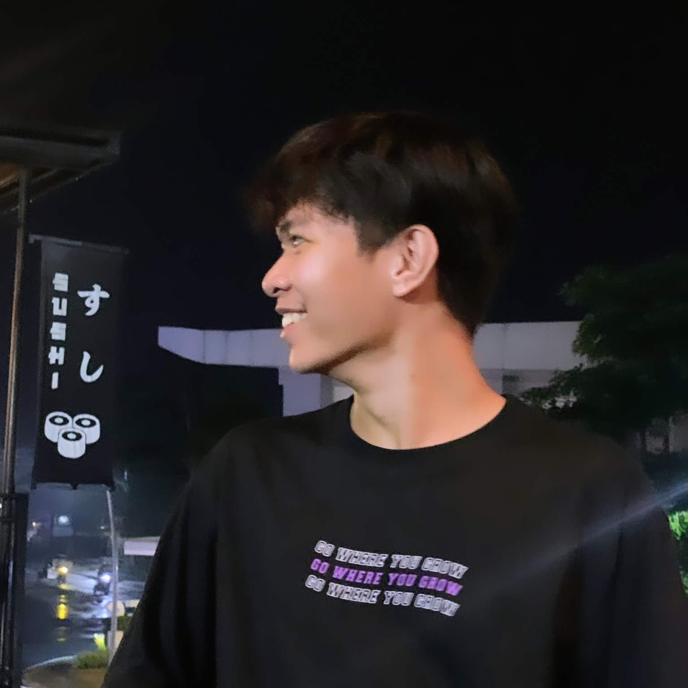

# Object Oriented Programming

---

## 👨‍💻 About Me

| | |
|:--|--:|
| **Name:** Brian Zabala **Loves:** Sleeping, Reading, and Sleeping again **Goal:** To challenge myself in the world of **Cyber Security** |  |

---

## 🎯 Areas of Interest & Languages  

- Reading  
- Learning  
- Puzzles  
- Science
- Philosophy 

### 💻 Languages I Know  

  HTML
  CSS
  C
  Java
  Bash Scripting

---

## 📂 Project Links  
- [🔗 Project 1](projects/LabActivity1_Zabala.pdf) – Midterm Lab Task 1 Getting started with Python
- [🔗 Project 2](projects/LabActivity2_Zabala.pdf) – Midterm Lab Task 2 Loop Construct
- [🔗 Project 3](projects/LabActivity3_Zabala.pdf) – Midterm Lab Task 3. Using List Collections 
- [🔗 Project 4](projects/LabActivity4_Zabala.pdf) – Midterm Lab Task 4. Using Dictionary Collections
- [🔗 Project 5](projects/LabActivity5_Zabala.pdf) – Midterm Lab Task 5. Creating and Instantiating Classes
- [🔗 Project 6](projects/LabActivity6_Zabala.pdf) – Midterm Lab Task 6. Overloaded Consturctors
- [🔗 Project 7](projects/Collections.pdf) – Practice Task using Collections
- [🔗 Project 8](projects/Pairtask.pdf) – Midterm Paired Task 1

---

## 😎 Facts About Me 
- My favourite author is Fyodor Dostoevsky  
- My Favourite color is Black  
- My Favourite artist is keshi  
- I have PTSD in Calculus  

---

## 📬 Contact Me  
- 📘 [Facebook](https://www.facebook.com/share/18T5bqWTgC/)  
- 💼 [LinkedIn](https://www.linkedin.com/in/brian-zabala-4a80a7321?utm_source=share&utm_campaign=share_via&utm_content=profile&utm_medium=android_app)  
- 📷 [Instagram](https://www.instagram.com/kur0_z?igsh=MTZkcW43ZG1kc2pvYg==)  
- 📧 **Email:** rzabala24-0038@cca.edu.ph

<pre style="background-color:black; color:#90EE90; font-size:16px;">

⠀⠀⠀⠀⡀⠀⠀⣀⠀⠀⠀⠀⠀⠀⠀⠀⠀⠀⠀⠀⠀⠀⠀⠀⠀⠀⠀⠀⠀⠀⡀⠀⠀⠀⠀⠀⠀⠀⠀⠀⠀⠀⠀⠀⠀⠀⡀⠀⠀⠀⠀⠀⠀⡀⠀⠀⠀⠀⠀⠀⠀⠀
⠀⢸⠉⣹⠋⠉⢉⡟⢩⢋⠋⣽⡻⠭⢽⢉⠯⠭⠭⠭⢽⡍⢹⡍⠙⣯⠉⠉⠉⠉⠉⣿⢫⠉⠉⠉⢉⡟⠉⢿⢹⠉⢉⣉⢿⡝⡉⢩⢿⣻⢍⠉⠉⠩⢹⣟⡏⠉⠹⡉⢻⡍⡇
⠀⢸⢠⢹⠀⠀⢸⠁⣼⠀⣼⡝⠀⠀⢸⠘⠀⠀⠀⠀⠈⢿⠀⡟⡄⠹⣣⠀⠀⠐⠀⢸⡘⡄⣤⠀⡼⠁⠀⢺⡘⠉⠀⠀⠀⠫⣪⣌⡌⢳⡻⣦⠀⠀⢃⡽⡼⡀⠀⢣⢸⠸⡇
⠀⢸⡸⢸⠀⠀⣿⠀⣇⢠⡿⠀⠀⠀⠸⡇⠀⠀⠀⠀⠀⠘⢇⠸⠘⡀⠻⣇⠀⠀⠄⠀⡇⢣⢛⠀⡇⠀⠀⣸⠇⠀⠀⠀⠀⠀⠘⠄⢻⡀⠻⣻⣧⠀⠀⠃⢧⡇⠀⢸⢸⡇⡇
⠀⢸⡇⢸⣠⠀⣿⢠⣿⡾⠁⠀⢀⡀⠤⢇⣀⣐⣀⠀⠤⢀⠈⠢⡡⡈⢦⡙⣷⡀⠀⠀⢿⠈⢻⣡⠁⠀⢀⠏⠀⠀⠀⢀⠀⠄⣀⣐⣀⣙⠢⡌⣻⣷⡀⢹⢸⡅⠀⢸⠸⡇⡇
⠀⢸⡇⢸⣟⠀⢿⢸⡿⠀⣀⣶⣷⣾⡿⠿⣿⣿⣿⣿⣿⣶⣬⡀⠐⠰⣄⠙⠪⣻⣦⡀⠘⣧⠀⠙⠄⠀⠀⠀⠀⠀⣨⣴⣾⣿⠿⣿⣿⣿⣿⣿⣶⣯⣿⣼⢼⡇⠀⢸⡇⡇⡇
⠀⢸⢧⠀⣿⡅⢸⣼⡷⣾⣿⡟⠋⣿⠓⢲⣿⣿⣿⡟⠙⣿⠛⢯⡳⡀⠈⠓⠄⡈⠚⠿⣧⣌⢧⠀⠀⠀⠀⠀⣠⣺⠟⢫⡿⠓⢺⣿⣿⣿⠏⠙⣏⠛⣿⣿⣾⡇⢀⡿⢠⠀⡇
⠀⢸⢸⠀⢹⣷⡀⢿⡁⠀⠻⣇⠀⣇⠀⠘⣿⣿⡿⠁⠐⣉⡀⠀⠁⠀⠀⠀⠀⠀⠀⠀⠀⠉⠓⠳⠄⠀⠀⠀⠀⠋⠀⠘⡇⠀⠸⣿⣿⠟⠀⢈⣉⢠⡿⠁⣼⠁⣼⠃⣼⠀⡇
⠀⢸⠸⣀⠈⣯⢳⡘⣇⠀⠀⠈⡂⣜⣆⡀⠀⠀⢀⣀⡴⠇⠀⠀⠀⠀⠀⠀⠀⠀⠀⠀⠀⠀⠀⠀⠀⠀⠀⠀⠀⠀⠀⠀⢽⣆⣀⠀⠀⠀⣀⣜⠕⡊⠀⣸⠇⣼⡟⢠⠏⠀⡇
⠀⢸⠀⡟⠀⢸⡆⢹⡜⡆⠀⠀⠀⠀⠀⠀⠀⠀⠀⠀⠀⠀⠀⠀⠀⠀⠀⠀⠀⠀⠀⠀⠀⠀⠀⠀⠀⠀⠀⠀⠀⠀⠀⠀⠀⠀⠀⠀⠀⠀⠀⠀⠀⠀⢠⠋⣾⡏⡇⡎⡇⠀⡇
⠀⢸⠀⢃⡆⠀⢿⡄⠑⢽⣄⠀⠀⠀⢀⠂⠠⢁⠈⠄⠀⠀⠀⠀⠀⠀⠀⠀⠀⠀⠀⠠⠂⠀⠀⠀⠀⠀⠀⠀⠀⠀⠀⠀⠀⡀⠀⠄⡐⢀⠂⠀⠀⣠⣮⡟⢹⣯⣸⣱⠁⠀⡇
⠀⠈⠉⠉⠋⠉⠉⠋⠉⠉⠉⠋⠉⠉⠉⠉⠉⠉⠉⠉⠉⠉⠉⠉⠉⠉⠉⠉⠉⠉⠉⠉⠉⠉⠉⠉⠉⠉⠉⠉⠉⠉⠉⠉⠉⠉⠉⠉⠉⠉⠉⠉⠋⡟⠉⠉⡿⠋⠋⠋⠉⠉⠁

</pre>
